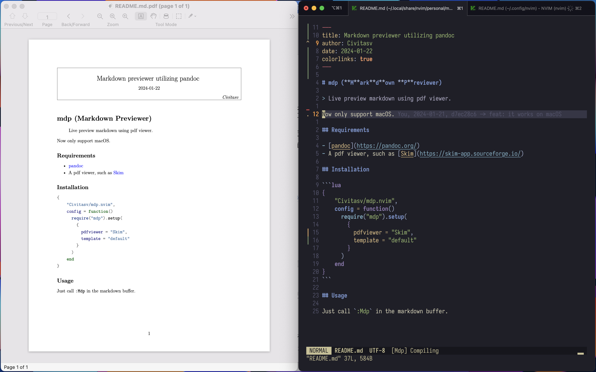

# mdp (**M**ark**d**own **P**reviewer)

> Live preview markdown using pdf viewer.



Now only support macOS.

## Requirements

- [pandoc](https://pandoc.org/)
- A pdf viewer, such as [Skim](https://skim-app.sourceforge.io/)

## Installation

```lua
{
    "Civitasv/mdp.nvim",
    config = function()
      require("mdp").setup(
        {
          pdfviewer = "Skim"
        }
      )
    end
}
```

## Usage

Just call `:Mdp` in the markdown buffer.
